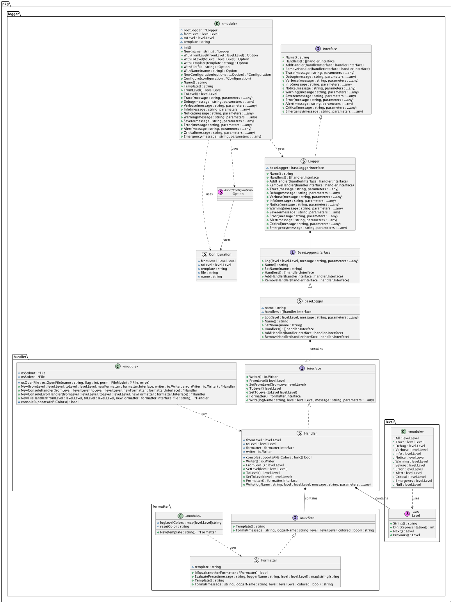
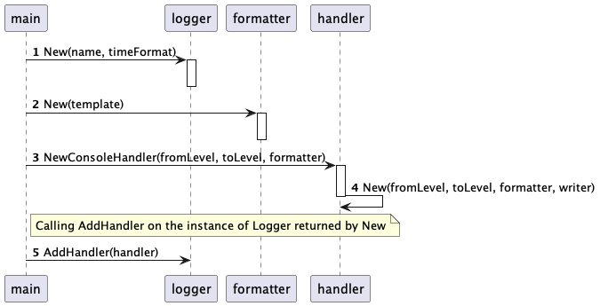

# Go Logger

[](https://pkg.go.dev/github.com/dl1998/go-logging)

Go logger implements logger for Golang, current implementation is majorly inspired by Python logger.

## Installation

```bash
go get github.com/dl1998/go-logging
```

or

```bash
go install github.com/dl1998/go-logging@[version]
```

***Note: replace `[version]` with the version you want to install.***

## Usage

Check examples provided in the [examples](./examples).

Logger supports 11 logging levels + 2 (when not set):

- All (special level, cannot be used for logging)
- Trace
- Debug
- Verbose
- Info
- Notice
- Warning
- Severe
- Error
- Alert
- Critical
- Emergency
- Null (special level, cannot be used for logging)

### Default Logger

Default logger could be used like in the following example:

- Standard logger

```go
logger.Warning("Message for logging: %s.", "my message")
```

- Structured logger

```go
structuredlogger.Warning("message", "My message.")
```

or

```go
structuredlogger.Warning(map[string]string{
    "message": "My message.",
})
```

By default, root logger prints on console only, and starting from Warning level. It could be changed by setting logging
level:

- Standard logger

```go
logger.Configure(logger.NewConfiguration(logger.WithFromLevel(level.All)))
```

- Structured logger

```go
structuredlogger.Configure(logger.NewConfiguration(logger.WithFromLevel(level.All)))
```

After changing log level to "All" it will print messages for any level.

You could also change the format of the default structured logger by setting the format (default: json).

```go
structuredlogger.Configure(logger.NewConfiguration(logger.WithFormat("key-value")))
```

All options available for the configuration are:

- For Standard Logger

| Method         |            Default            | Description                                                                        |
|----------------|:-----------------------------:|------------------------------------------------------------------------------------|
| WithFromLevel  |         level.Warning         | Set logging level from which logger should log messages.                           |
| WithToLevel    |          level.Null           | Set logging level till which logger should log messages.                           |
| WithTemplate   | "%(level):%(name):%(message)" | Set template for logging message.                                                  |
| WithFile       |              ""               | Set file where to log messages, if not set, then logging to file will be disabled. |
| WithName       |            "root"             | Set logger name.                                                                   |
| WithTimeFormat |         time.RFC3339          | Set time format for logging message.                                               |

- For Structured Logger

| Method                |                                                       Default                                                       | Description                                                                                                                           |
|-----------------------|:-------------------------------------------------------------------------------------------------------------------:|---------------------------------------------------------------------------------------------------------------------------------------|
| WithFromLevel         |                                                    level.Warning                                                    | Set logging level from which logger should log messages.                                                                              |
| WithToLevel           |                                                     level.Null                                                      | Set logging level till which logger should log messages.                                                                              |
| WithTemplate          | map[string]string {<br/>"timestamp": "%(timestamp)",<br/>"level":     "%(level)",<br/>"name":      "%(name)",<br/>} | Set template for logging structure.                                                                                                   |
| WithFile              |                                                         ""                                                          | Set file where to log messages, if not set, then logging to file will be disabled.                                                    |
| WithFormat            |                                                       "json"                                                        | Set format for structured logging.<br/><br/>Could be one of the following<br/><ul><li>json</li><li>key-value</li></ul>                |
| WithPretty            |                                                        false                                                        | Set if json message should be pretty printed.<br/>*Option works only with "json" format.*                                             |
| WithKeyValueDelimiter |                                                         "="                                                         | Set key-value delimiter (eg. "key=value", where '=' is the delimiter).<br/>*Option works only with "key-value" format.*               |
| WithPairSeparator     |                                                         " "                                                         | Set key-value separator (eg. "key1=value1,key2=value2", where ',' is the separator).<br/>*Option works only with "key-value" format.* |
| WithName              |                                                       "root"                                                        | Set logger name.                                                                                                                      |
| WithTimeFormat        |                                                    time.RFC3339                                                     | Set time format for logging message.                                                                                                  |

### Custom Logger

Alternatively you could create application logger. To do this you would need to create a new logger.

- Standard logger

```go
applicationLogger := logger.New("application-logger", time.RFC3339)
```

- Standard async logger

```go
applicationLogger := logger.NewAsyncLogger("application-logger", time.RFC3339, 100)
```

- Structured logger

```go
applicationLogger := structuredlogger.New("application-logger", time.RFC3339)
```

- Structured async logger

```go
applicationLogger := structuredlogger.NewAsyncLogger("application-logger", time.RFC3339, 100)
```

After this you need to set up it, for this create a new formatter that says how to log the message by providing a
template.

#### Formatter

Available template options:

|    Option    |      Scope      | Description                                                                  |
|:------------:|:---------------:|------------------------------------------------------------------------------|
|   %(name)    |      Both       | Logger name.                                                                 |
|   %(level)   |      Both       | Log level name.                                                              |
|  %(levelnr)  |      Both       | Log level number.                                                            |
| %(datetime)  |      Both       | Current date and/or time formatted using time format. Default: time.RFC3339. |
| %(timestamp) |      Both       | Current timestamp.                                                           |
|   %(fname)   |      Both       | Name of the file from which logger has been called.                          |
|   %(fline)   |      Both       | Line in the file in which logger has been called.                            |
|  %(message)  | standard logger | Log message.                                                                 |

- Standard logger

```go
applicationFormatter := formatter.New("%(datetime) [%(level)] %(message)")
```

- Structured logger
    - JSON format

    ```go
    applicationFormatter := formatter.NewJSON(map[string]string{
        "time":    "%(timestamp)",
        "level":   "%(level)",
    }, false)
    ```

    - Key-Value format

    ```go
    applicationFormatter := formatter.NewKeyValue(map[string]string{
        "time":    "%(timestamp)",
        "level":   "%(level)",
    }, "=", " ")
    ```

After creation of the formatter, you need to create a new handler that tells where to write log messages.

#### Handler

There are three predefined types of handler (for standard and structured logger each):

- Console Handler - it takes log level starting from which it would log messages, log level till which it would log
  messages, and formatter that tells how to log message. It logs messages to standard output.

```go
newConsoleHandler := handler.NewConsoleHandler(level.Debug, level.Null, applicationFormatter)
```

- Console Error Handler - it takes log level starting from which it would log messages, log level till which it would
  log messages, and formatter that tells how to log message. It logs messages to error output.

```go
newConsoleErrorHandler := handler.NewConsoleErrorHandler(level.Debug, level.Null, applicationFormatter)
```

- File Handler - it takes log level starting from which it would log messages, log level till which it would
  log messages, formatter that tells how to log message, and path to the file where to log those data.

```go
newFileHandler := handler.NewFileHandler(level.Debug, level.Null, applicationFormatter, "system.log")
```

You could create your custom handler:

```go
customHandler := handler.New(level.Debug, level.Null, applicationFormatter, os.Stdout)
```

It takes two additional arguments writer for standard messages and for error messages. Standard message logs till
"Error" level, after this error writer is used.

After handler has been created it shall be registered.

```go
// Register console stdout handler.
applicationLogger.AddHandler(newConsoleHandler)
// Register console stderr handler.
applicationLogger.AddHandler(newConsoleErrorHandler)
// Register file handler.
applicationLogger.AddHandler(newFileHandler)
```

Now it could be used to log the message, simply by calling respective level of logging and providing message with
arguments.

- Standard logger

```go
applicationLogger.Info("My message: %s.", "logged using application logger")
```

- Standard async logger

```go
applicationLogger.Info("My message: %s.", "logged using application async logger")

// Wait for all messages to be logged before exiting the program.
applicationLogger.WaitToFinishLogging()
```

- Structured logger
    - Varargs

    ```go
    applicationLogger.Info("message", "Logged using structured logger with varargs.")
    ```

    - Map

    ```go
    applicationLogger.Info(map[string]string{
        "message": "Logged using structured logger with map.",
    })
    ```

- Structured async logger
  - Varargs

    ```go
    applicationLogger.Info("message", "Logged using structured logger with varargs.")
    
    // Wait for all messages to be logged before exiting the program.
	applicationLogger.WaitToFinishLogging()
    ```

  - Map

    ```go
    applicationLogger.Info(map[string]string{
        "message": "Logged using structured logger with map.",
    })
    
    // Wait for all messages to be logged before exiting the program.
	applicationLogger.WaitToFinishLogging()
    ```

#### Async Loggers - Additional Information

Async loggers are used to log messages asynchronously. It is useful when you want to log messages without blocking the
main thread. However, you need to wait for all messages to be logged before exiting the program. You can do this by
calling the `WaitToFinishLogging` method, it will block the main thread until all messages are logged. Alternatively,
you can close the logger by calling the `Close` method, it will close the message queue without waiting for all messages
to be logged. This is useful when you want to exit the program without waiting for all messages to be logged. After
calling the `Close` method, you can open the logger again by calling the `Open` method, it accepts the new message queue
size as an argument. `Open` method will open the logger with the new message queue size and start listening for the
messages.

Example that waits for all messages to be logged, then close the logger and open it again with a new message queue size:

```go
for index := 0; index < 1000; index++ {
    applicationLogger.Info("Counter: %d.", index)
}

// Wait for all messages to be logged before exiting the program.
applicationLogger.WaitToFinishLogging()

// Close the logger.
applicationLogger.Close()

// Open the logger with a new message queue size.
applicationLogger.Open(100)
```

*Note: if you assign a new message queue size that is smaller than the number of messages sent to the queue, the logger
will add messages to the queue until it is not full, then it will wait (blocking the process) until the message from the
queue will be processed and free up the space in the message queue.*

## Class Diagram



## Sequence Diagram - Create A New Logger

