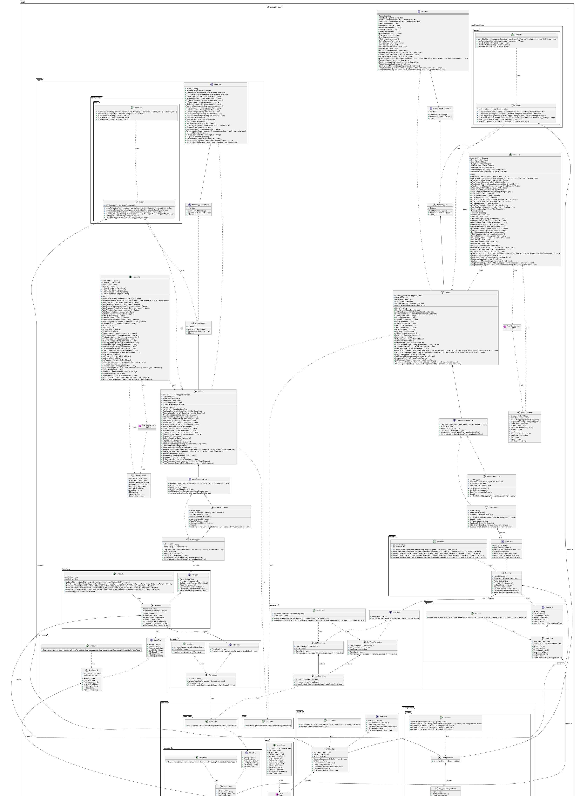

# Go Logger

[](https://pkg.go.dev/github.com/dl1998/go-logging)

Go logger implements logger for Golang, current implementation is majorly inspired by Python logger.


## Installation

```bash
go get github.com/dl1998/go-logging
```

or

```bash
go install github.com/dl1998/go-logging@v1.0.0
```

## Usage

Check examples provided in the [examples](./examples).


## Class Diagram

